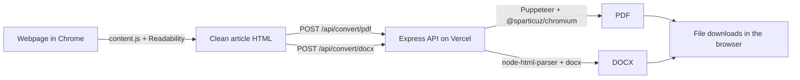

<p align="center">
  
</p>

<h1 align="center">Bobdoc</h1>

<p align="center">
  <strong>Stop copy-pasting. One click to a clean doc.</strong><br/>
  A free Chrome extension that exports any webpage to a properly formatted <b>DOCX</b> or <b>PDF</b>,
  with ads, sidebars and broken formatting left behind.
</p>

<p align="center">
  <a href="https://bobdoc.vercel.app">Website</a> ·
  <a href="#getting-started">Getting started</a> ·
  <a href="#how-it-works">How it works</a> ·
  <a href="#roadmap">Roadmap</a>
</p>

---

## Why Bobdoc?

Copying an article into Word usually means five minutes spent fixing it: ads and navbars come along, tables
collapse, and browser-only "PDF" exporters produce a 10–20 MB screenshot you can't search.

Bobdoc pulls out just the article, then renders it on a server with real document engines:

| | Typical browser-only extension | Bobdoc |
|---|---|---|
| PDF text | Raster image, not searchable | Real text: copy, search, zoom |
| Page breaks | Text overlaps page edges | Clean A4 page breaks |
| File size | 10–20 MB for a simple article | Typically under 300 KB |
| DOCX tables | No borders | Borders and header shading |
| Layout | Zero margins | 25 mm margins, header title, page numbers |

## Features

- **One-click export** to DOCX or PDF from the extension popup.
- **Clutter removal** with [Mozilla Readability](https://github.com/mozilla/readability): ads, navbars, cookie
  banners, related posts and comments are removed before conversion.
- **Real-text PDFs** rendered by headless Chromium (Puppeteer): A4, 25 mm / 22 mm margins, the document title in
  the header and `page / total` in the footer.
- **Native Word documents** built with the [`docx`](https://github.com/dolanmiu/docx) library: Word heading styles
  (H1–H5), bulleted and numbered lists, bordered tables with shaded header rows, blockquotes, shaded code blocks,
  bold / italic / underline / strikethrough, sub/superscript and clickable hyperlinks.
- **No account, no setup.** The extension talks to the hosted API at `https://bobdoc.vercel.app`.




1. You click **Download DOCX** or **Download PDF** in the popup (`chrome-extension/popup.js`).
2. The content script (`chrome-extension/content.js`) clones the page, runs Readability on the clone and gets
   the article title and clean HTML.
3. It POSTs `{ html, title }` to the backend.
4. The backend (`backend/api/index.js`) sends the HTML to one of two converters:
   - `backend/api/pdf.js`: wraps the HTML in a print stylesheet and prints it with Puppeteer. On Vercel it uses
     `@sparticuz/chromium-min`; locally it uses your installed Chrome.
   - `backend/api/docx.js`: parses the HTML with `node-html-parser` and maps each element to a Word construct.
5. The file comes back as binary, and the content script triggers the download.

## Project structure

```
bobdoc/
├── chrome-extension/        # Manifest V3 extension (load this folder unpacked)
│   ├── manifest.json
│   ├── popup.html / popup.js    # Dark UI with the two export buttons
│   ├── content.js               # Readability extraction + API call + download
│   ├── libs/Readability.js      # Mozilla Readability (vendored)
│   └── icons/
├── backend/                 # Express API, deployed to Vercel
│   ├── api/index.js             # Routes, CORS, request validation
│   ├── api/pdf.js               # HTML → PDF via Puppeteer
│   ├── api/docx.js              # HTML → DOCX via docx
│   ├── public/index.html        # Landing page (bobdoc.vercel.app)
│   └── vercel.json
├── marketing/linkedin-carousel/ # 2:3 LinkedIn carousel (HTML source, PNGs, PDF)
└── bobdoc-extension.zip     # Packaged extension
```

## Getting started

### Install the extension (no build step)

1. Download or clone this repo.
2. Open `chrome://extensions` and switch on **Developer mode**.
3. Click **Load unpacked** and select the `chrome-extension/` folder.
4. Open any article, click the Bobdoc icon and choose **Download DOCX** or **Download PDF**.

The extension uses the hosted backend by default, so nothing else is needed.

### Run the backend locally

Requires **Node.js 20+** and a local Chrome or Chromium for PDF export.

```bash
cd backend
npm install
# Optional: point to your Chrome binary if it isn't in the default location
# export CHROME_PATH="/usr/bin/google-chrome"
npm run dev          # http://localhost:3000
```

Then change `BACKEND_URL` at the top of `chrome-extension/content.js` to `http://localhost:3000`, add
`"http://localhost:3000/*"` to `host_permissions` in `manifest.json`, and reload the extension.

Quick check:

```bash
curl http://localhost:3000/api                       # {"status":"ok"}
curl -X POST http://localhost:3000/api/convert/pdf \
  -H "Content-Type: application/json" \
  -d '{"title":"Hello","html":"<p>Hello <b>world</b></p>"}' \
  -o hello.pdf
```

### Deploy your own backend

```bash
cd backend
npx vercel deploy
```

`vercel.json` routes `/api/*` to the Express app and everything else to `public/` (the landing page). Update
`BACKEND_URL` and `host_permissions` in the extension to match your deployment URL.

## API reference

| Method | Path | Body | Response |
|---|---|---|---|
| `GET` | `/api` | none | `{ "status": "ok" }` |
| `POST` | `/api/convert/pdf` | `{ "html": string, "title"?: string }` | `application/pdf` attachment |
| `POST` | `/api/convert/docx` | `{ "html": string, "title"?: string }` | `.docx` attachment |

- `html` is required (`400` if missing). The JSON body limit is **10 MB**.
- Conversion errors return `500` with `{ "error": "<message>" }`.
- CORS is open (`*`) so the extension can call the API from any page.

## Tech stack

| Layer | Tools |
|---|---|
| Extension | Chrome Manifest V3, Mozilla Readability, vanilla JS |
| API | Node.js 20, Express 4, Vercel serverless functions |
| PDF | Puppeteer Core 23, `@sparticuz/chromium-min` 131 |
| DOCX | `docx` 8, `node-html-parser` 6 |

## Privacy

To convert a page, the extension sends the **extracted article HTML and title** to the Bobdoc API. The backend
converts it in memory and returns the file; the code does not store or log the content. Pages are only read
when you click an export button.

## Known limitations

- **Images are not included in DOCX exports** yet (`` is skipped in `docx.js`). PDFs include them when the image URL is publicly reachable.
- **Nested lists are flattened** in DOCX, and numbered lists share one counter, so a second `<ol>` keeps
  counting from where the first ended.
- DOCX output has no header or page numbers, unlike the PDF.
- PDF page size is fixed to A4; there is no US Letter option.
- Readability works best on article-style pages. Web apps, dashboards and pages behind heavy client-side
  rendering may fail with "Could not extract readable content".
- PDF export cold starts on Vercel can take a few seconds while Chromium is downloaded.

## Roadmap

### Phase 1: Quality fixes (next up)

- [ ] **Images in DOCX:** fetch `` sources on the server and embed them with `ImageRun`, with size limits
      and a timeout.
- [ ] **Correct list handling:** support nested `<ul>/<ol>` levels and restart numbering for each list.
- [ ] **DOCX header and footer:** add the title in the header and page numbers in the footer, to match the PDF.
- [ ] **Source attribution:** optionally add the page URL and export date under the title.
- [ ] **Clearer errors:** user-friendly messages for unsupported pages, timeouts and oversized pages.

### Phase 2: Repo and reliability

- [ ] Stop committing `backend/node_modules/` and test output files (`*.pdf`, `*.docx` in `backend/`); extend
      `.gitignore`.
- [ ] Add a `LICENSE` file.
- [ ] Unit tests for the HTML → DOCX mapping, plus snapshot tests for PDF and DOCX output.
- [ ] GitHub Actions CI: lint, tests, and building `bobdoc-extension.zip` from `chrome-extension/`.
- [ ] Backend hardening: rate limiting, a request timeout, tighter CORS (extension origin only), and rendering
      PDFs with JavaScript disabled and requests to private network addresses blocked.

### Phase 3: Features

- [ ] **Export options in the popup:** page size (A4 / Letter), font (serif / sans), include images on/off.
- [ ] **Export a selection** instead of the whole article.
- [ ] **Right-click menu and keyboard shortcut** for one-step export.
- [ ] **More formats:** Markdown and plain text, which can run entirely in the browser.
- [ ] **Preview before download** so users can check the extraction.

### Phase 4: Distribution

- [ ] Publish to the **Chrome Web Store**.
- [ ] Port to **Microsoft Edge** and **Firefox** (WebExtensions).
- [ ] Landing page: demo GIF, before/after samples and an FAQ.

Have an idea or found a page that doesn't export well? Open an issue with the URL and what you expected.

## Contributing

1. Fork the repo and create a branch.
2. For backend changes, run `npm run dev` in `backend/` and test with the `curl` commands above.
3. For extension changes, reload the unpacked extension in `chrome://extensions`.
4. Open a pull request describing the change and, where useful, attach a sample export.

## Credits

Created by [@aamsap](https://github.com/aamsap). Built on Mozilla Readability, Puppeteer,
@sparticuz/chromium, docx, node-html-parser, Express and Vercel.
